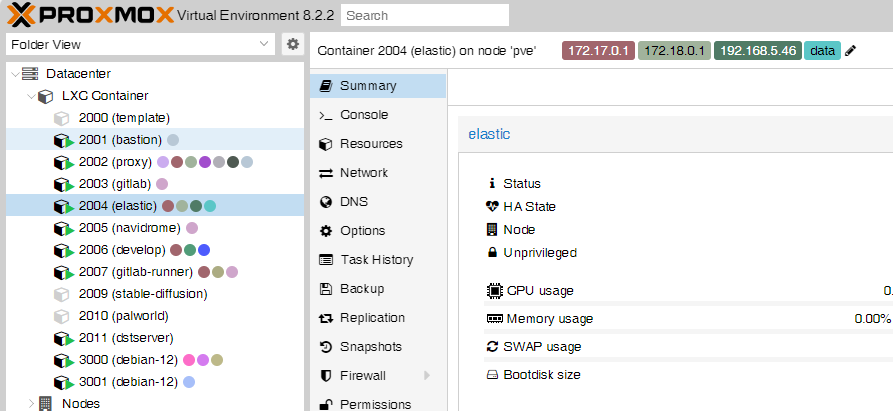

# lxc-iptag

lxc-iptag is a simple script to add ip tags to LXC containers.



## 1. Installation

```sh
curl -sL https://github.com/gitsang/lxc-iptag/raw/main/install.sh | bash
```

This script will:

- Install script prerequisites
- Install the `lxc-iptag` script to `/usr/local/bin/lxc-iptag`
- Copy config file to `/usr/local/etc/lxc-iptag.conf`
- Add a systemd unit to start the service

### 1.1 Update

```sh
curl -sSL https://raw.githubusercontent.com/gitsang/lxc-iptag/main/lxc-iptag -o /usr/local/bin/lxc-iptag && chmod +x /usr/local/bin/lxc-iptag
systemctl restart lxc-iptag.service
```

This script will only update the `lxc-iptag` executable script

## 2. Configure

Open `/usr/local/etc/lxc-iptag.conf` and change the config

| Option                          | Example                                     | Description                                                                                             |
| ------------------------------- | ------------------------------------------- | ------------------------------------------------------------------------------------------------------- |
| CIDR_LIST                       | `(192.168.0.0/16 100.64.0.0/10 10.0.0.0/8)` | IP filter list in CIDR format                                                                           |
| LOOP_INTERVAL                   | `60`                                        | Main loop interval(seconds)                                                                             |
| FW_NET_INTERFACE_CHECK_INTERVAL | `60`                                        | The interval(seconds) for using `ifconfig` to check lxc status changed (Set -1 to disable this feature) |
| LXC_STATUS_CHECK_INTERVAL       | `-1`                                        | The interval(seconds) for using `pct list` to check lxc status changed (Set -1 to disable this feature) |
| FORCE_UPDATE_INTERVAL           | `1800`                                      | The interval(seconds) for force check and update lxc tags                                               |
